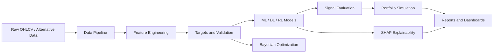

# AI-Driven Quant Research & Predictive Trading Platform

A modular Python research platform for building, testing, explaining, and evaluating machine
learning trading signals. The project is designed as a step-by-step path from beginner-friendly
quant research foundations to an institutional-style workflow with factor engineering,
regime-aware modeling, reinforcement learning, explainability, optimization, and portfolio
analytics.

This repository previously contained a complete options-pricing and volatility analytics project.
Those modules remain available and can later be reused as a derivatives analytics layer, but the
active learning track now starts with the AI-driven quant research platform described below.


## Why This Project Matters

In finance, a model is not useful just because it predicts well on a spreadsheet. A real quant
research workflow must answer harder questions:

- Was the model trained only on information available at the time?
- Does the signal survive transaction costs and drawdowns?
- Is performance stable across regimes?
- Can the prediction be explained to risk managers and portfolio managers?
- Can the experiment be reproduced by another researcher?

The platform is structured around those questions.

## Required Tools

- **Python**: main language for quant research, ML, and automation.
- **Pandas**: time-series tables, OHLCV cleaning, joins, resampling, and rolling features.
- **NumPy**: fast numerical arrays for returns, volatility, and portfolio math.
- **Scikit-learn**: baseline ML models, preprocessing, metrics, and validation utilities.
- **XGBoost**: high-performing tabular model for nonlinear factor interactions.
- **PyTorch**: deep learning framework for LSTM and reinforcement learning components.
- **SHAP**: explains feature contribution and makes black-box models auditable.
- **Optuna**: Bayesian hyperparameter optimization for models and strategy parameters.
- **Matplotlib**: static research and report charts.
- **Plotly**: interactive dashboards and exploratory visualizations.

## Project Structure

```text
options-pricing/
|-- data/
|   |-- pipeline.py
|   |-- sample_vol_surface.csv
|   `-- README.md
|-- features/
|   `-- base.py
|-- models/
|   |-- research.py
|   |-- black_scholes.py
|   `-- sabr.py
|-- evaluation/
|   `-- metrics.py
|-- optimization/
|   `-- search_space.py
|-- rl/
|   `-- environment.py
|-- explainability/
|   `-- model_cards.py
|-- visualization/
|   |-- research_charts.py
|   `-- charts.py
|-- notebooks/
|   `-- 13_ai_quant_project_setup.md
|-- docs/
|   `-- AI_QUANT_ARCHITECTURE.md
|-- tests/
|   `-- test_ai_quant_scaffold.py
|-- results/
|-- requirements.txt
|-- pyproject.toml
`-- README.md
```

## Module Roles In A Quant Pipeline

`data/` owns ingestion and preprocessing. This is where OHLCV data from Forex, gold, stocks,
crypto, yfinance, Alpha Vantage, and CSV files will be normalized, aligned, cleaned, and made
feature-ready.

`features/` turns clean prices into alpha candidates: returns, momentum, volatility, volume,
market-structure, and alternative-data features. This is where raw prices become model inputs.

`models/` contains predictive models. The starter `models/research.py` defines the common
interface that future XGBoost, LSTM, ensemble, and regime-aware models will follow.

`evaluation/` measures whether predictions matter in trading terms. Finance cares about Sharpe,
drawdown, IC, IR, CAGR, and turnover, not only accuracy or RMSE.

`optimization/` contains Optuna and Bayesian search logic. This lets us tune models without
wasting time on inefficient grid search.

`rl/` contains the trading environment and future DQN, PPO, and Actor-Critic agents. RL belongs
in its own module because it is a sequential decision-making system, not just a forecast model.

`explainability/` stores SHAP and model-card tools so predictions can be inspected, challenged,
and documented.

`visualization/` produces research charts: prediction vs actual, equity curves, drawdowns,
feature importance, regimes, RL rewards, and allocation views.

`notebooks/` contains guided learning notes. In this project, notebooks are for explanation and
experimentation, while production logic lives in modules.

`tests/` protects the research code from silent breakage. Quant code needs tests because small
data-alignment bugs can create fake alpha.

`results/` stores generated reports, charts, and experiment outputs.

## Architecture



## Quickstart

Create and activate a virtual environment:

```powershell
python -m venv .venv
.\.venv\Scripts\Activate.ps1
```

Install dependencies:

```powershell
python -m pip install -r requirements.txt
```

Run tests:

```powershell
python -m pytest -q
```

Run lint checks:

```powershell
python -m ruff check .
```

Run the AI quant demo:

```powershell
.\.venv\Scripts\python.exe -m examples.run_ai_quant_demo
```

Demo outputs are written to:

```text
results/examples/ai_quant_demo/
```

REPOSITORY CLONE 

https://github.com/Erramshettiabhilash/algorithmic-trading-system

