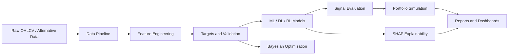

# AI-Driven Quant Research & Predictive Trading Platform

A modular Python research platform for building, testing, explaining, and evaluating machine
learning trading signals. The project is designed as a step-by-step path from beginner-friendly
quant research foundations to an institutional-style workflow with factor engineering,
regime-aware modeling, reinforcement learning, explainability, optimization, and portfolio
analytics.

This repository previously contained a complete options-pricing and volatility analytics project.
Those modules remain available and can later be reused as a derivatives analytics layer, but the
active learning track now starts with the AI-driven quant research platform described below.

## Current Status

Implemented:

- Professional project structure
- Core dependency list in `requirements.txt`
- Starter interfaces for data, features, models, evaluation, optimization, RL, explainability,
  and visualization
- Architecture documentation in `docs/AI_QUANT_ARCHITECTURE.md`
- Step 1 learning notes in `notebooks/13_ai_quant_project_setup.md`
- Architecture smoke tests in `tests/test_ai_quant_scaffold.py`
- Step 2 data ingestion from CSV/yfinance adapters
- OHLCV cleaning, timestamp alignment, normalization, and multi-asset dataset construction
- Step 2 learning notes in `notebooks/14_data_collection_preprocessing.md`
- Step 3 feature engine for returns, momentum, volatility, volume, and market structure
- Step 3 learning notes in `notebooks/15_feature_engineering_engine.md`
- Step 4 target construction, temporal splits, expanding/rolling validation, IC, and IR
- Step 4 learning notes in `notebooks/16_target_variable_research_design.md`
- Step 5 XGBoost factor model, temporal tuning helper, feature importance, and ML/trading report
- Step 5 learning notes in `notebooks/17_xgboost_factor_model.md`
- Step 6 PyTorch LSTM time-series forecaster with sliding-window sequence creation
- Step 6 learning notes in `notebooks/18_lstm_time_series_model.md`
- Step 7 SHAP explainability engine with feature importance, dependence data, local explanations,
  and interaction summaries
- Step 7 learning notes in `notebooks/19_shap_explainability_engine.md`
- Step 8 Gymnasium reinforcement-learning trading environment and DQN/PPO/Actor-Critic factories
- Step 8 learning notes in `notebooks/20_reinforcement_learning_trading.md`
- Step 9 deterministic, clustering, and HMM regime detection with dynamic regime-aware model
  switching
- Step 9 learning notes in `notebooks/21_regime_detection_regime_aware_ml.md`
- Step 10 alternative-data engine for sentiment, Google Trends, and macro indicators
- Step 10 learning notes in `notebooks/22_alternative_data_engine.md`
- Step 11 Optuna/Hyperopt Bayesian optimization engine for XGBoost, LSTM, and RL
- Step 11 learning notes in `notebooks/23_bayesian_optimization_engine.md`
- Step 12 ensemble framework with weighted averaging, voting, stacking, and robustness comparison
- Step 12 learning notes in `notebooks/24_ensemble_framework.md`
- Step 13 walk-forward research pipeline with rolling/expanding retraining, alpha decay, drift,
  and stability diagnostics
- Step 13 learning notes in `notebooks/25_walk_forward_research_pipeline.md`
- Step 14 factor risk model with beta exposure, covariance, return decomposition, volatility
  factors, and risk contribution
- Step 14 learning notes in `notebooks/26_factor_risk_modeling.md`
- Step 15 trading integration with signal generation, position sizing, execution simulation, and
  portfolio performance analytics
- Step 15 learning notes in `notebooks/27_trading_integration_portfolio_evaluation.md`
- Step 16 visualization and analytics layer with research charts, allocation dashboards, and
  Markdown reports
- Step 16 learning notes in `notebooks/28_visualization_analytics.md`
- Step 17 code quality checks, shared validation helpers, package typing markers, and engineering
  documentation
- Step 17 learning notes in `notebooks/29_code_quality_engineering.md`
- Step 18 final AI quant demo, final project summaries, generated reports, and GitHub-ready
  documentation
- Step 18 final summary in `docs/AI_QUANT_FINAL_PROJECT_SUMMARY.md`

## Why This Project Matters

In finance, a model is not useful just because it predicts well on a spreadsheet. A real quant
research workflow must answer harder questions:

- Was the model trained only on information available at the time?
- Does the signal survive transaction costs and drawdowns?
- Is performance stable across regimes?
- Can the prediction be explained to risk managers and portfolio managers?
- Can the experiment be reproduced by another researcher?

The platform is structured around those questions.

## Required Tools

- **Python**: main language for quant research, ML, and automation.
- **Pandas**: time-series tables, OHLCV cleaning, joins, resampling, and rolling features.
- **NumPy**: fast numerical arrays for returns, volatility, and portfolio math.
- **Scikit-learn**: baseline ML models, preprocessing, metrics, and validation utilities.
- **XGBoost**: high-performing tabular model for nonlinear factor interactions.
- **PyTorch**: deep learning framework for LSTM and reinforcement learning components.
- **SHAP**: explains feature contribution and makes black-box models auditable.
- **Optuna**: Bayesian hyperparameter optimization for models and strategy parameters.
- **Matplotlib**: static research and report charts.
- **Plotly**: interactive dashboards and exploratory visualizations.

## Project Structure

```text
options-pricing/
|-- data/
|   |-- pipeline.py
|   |-- sample_vol_surface.csv
|   `-- README.md
|-- features/
|   `-- base.py
|-- models/
|   |-- research.py
|   |-- black_scholes.py
|   `-- sabr.py
|-- evaluation/
|   `-- metrics.py
|-- optimization/
|   `-- search_space.py
|-- rl/
|   `-- environment.py
|-- explainability/
|   `-- model_cards.py
|-- visualization/
|   |-- research_charts.py
|   `-- charts.py
|-- notebooks/
|   `-- 13_ai_quant_project_setup.md
|-- docs/
|   `-- AI_QUANT_ARCHITECTURE.md
|-- tests/
|   `-- test_ai_quant_scaffold.py
|-- results/
|-- requirements.txt
|-- pyproject.toml
`-- README.md
```

## Module Roles In A Quant Pipeline

`data/` owns ingestion and preprocessing. This is where OHLCV data from Forex, gold, stocks,
crypto, yfinance, Alpha Vantage, and CSV files will be normalized, aligned, cleaned, and made
feature-ready.

`features/` turns clean prices into alpha candidates: returns, momentum, volatility, volume,
market-structure, and alternative-data features. This is where raw prices become model inputs.

`models/` contains predictive models. The starter `models/research.py` defines the common
interface that future XGBoost, LSTM, ensemble, and regime-aware models will follow.

`evaluation/` measures whether predictions matter in trading terms. Finance cares about Sharpe,
drawdown, IC, IR, CAGR, and turnover, not only accuracy or RMSE.

`optimization/` contains Optuna and Bayesian search logic. This lets us tune models without
wasting time on inefficient grid search.

`rl/` contains the trading environment and future DQN, PPO, and Actor-Critic agents. RL belongs
in its own module because it is a sequential decision-making system, not just a forecast model.

`explainability/` stores SHAP and model-card tools so predictions can be inspected, challenged,
and documented.

`visualization/` produces research charts: prediction vs actual, equity curves, drawdowns,
feature importance, regimes, RL rewards, and allocation views.

`notebooks/` contains guided learning notes. In this project, notebooks are for explanation and
experimentation, while production logic lives in modules.

`tests/` protects the research code from silent breakage. Quant code needs tests because small
data-alignment bugs can create fake alpha.

`results/` stores generated reports, charts, and experiment outputs.

## Architecture



## Quickstart

Create and activate a virtual environment:

```powershell
python -m venv .venv
.\.venv\Scripts\Activate.ps1
```

Install dependencies:

```powershell
python -m pip install -r requirements.txt
```

Run tests:

```powershell
python -m pytest -q
```

Run lint checks:

```powershell
python -m ruff check .
```

Run the AI quant demo:

```powershell
.\.venv\Scripts\python.exe -m examples.run_ai_quant_demo
```

Demo outputs are written to:

```text
results/examples/ai_quant_demo/
```

## Step Roadmap

1. Project setup and architecture
2. Data collection and preprocessing
3. Feature engineering engine
4. Target variable and research design
5. XGBoost factor model
6. LSTM time-series model
7. SHAP explainability engine
8. Reinforcement learning trading
9. Regime detection and regime-aware ML
10. Alternative data engine
11. Bayesian optimization engine
12. Ensemble framework
13. Walk-forward research pipeline
14. Factor risk modeling
15. Trading integration and portfolio evaluation
16. Visualization and analytics
17. Code quality and engineering
18. Final output and GitHub-ready documentation

## Step 1 Learning Takeaway

The point of Step 1 is not to write a trading model yet. The point is to build the workspace where
future research can be done without mixing concerns. Clean architecture is a source of research
quality: it helps prevent leakage, makes experiments reproducible, and forces every model to be
judged by out-of-sample trading performance.

## Step 2 Learning Takeaway

The point of Step 2 is to make market data trustworthy before modeling. Raw OHLCV data is cleaned,
standardized, timestamp-aligned, and transformed into normalized feature-ready columns. This is
where we start defending the project against lookahead bias, survivorship bias, leakage, and
timestamp mistakes.

## Step 3 Learning Takeaway

The point of Step 3 is to convert prices into research hypotheses. Return, momentum, volatility,
volume, and market-structure features each capture a different possible source of alpha. The engine
keeps those families modular so they can later be tested, selected, explained with SHAP, and judged
by IC and trading performance.

## Step 4 Learning Takeaway

The point of Step 4 is to define the prediction problem without breaking time. Targets are forward
returns or future direction labels aligned to the decision timestamp. Validation is chronological,
using temporal, expanding, and rolling windows so models are always trained on the past and tested
on the future.

## Step 5 Learning Takeaway

The point of Step 5 is to train the first predictive factor model and judge it like a trading
system. XGBoost is useful because it captures nonlinear factor interactions in tabular data.
Evaluation now includes RMSE, accuracy, Sharpe, max drawdown, and IC, because prediction quality
and trading quality are not the same thing.

## Step 6 Learning Takeaway

The point of Step 6 is to compare tabular factor learning with sequential learning. The LSTM uses
sliding windows of past features to model temporal memory, which can help with volatility
clustering, trend transitions, and path-dependent market behavior. It is also easier to overfit, so
it must be judged against XGBoost with the same chronological evaluation discipline.

## Step 7 Learning Takeaway

The point of Step 7 is model transparency. SHAP explains which features pushed a forecast up or
down, both globally and for individual timestamps. In finance, this helps detect fragile signals,
communicate model behavior, support risk review, and avoid treating black-box predictions as
unquestionable truth.

## Step 8 Learning Takeaway

The point of Step 8 is to shift from prediction to sequential decision-making. The RL environment
turns OHLCV history, current position, transaction costs, and portfolio returns into a learning
problem. DQN, PPO, and Actor-Critic agents can be trained on this environment, but their value must
be judged by out-of-sample trading metrics against simpler XGBoost-style signal strategies.

## Step 9 Learning Takeaway

The point of Step 9 is adaptivity. Markets alternate between trending, ranging, and high-volatility
conditions, so one global model can become a weak compromise. Regime detection lets the platform
train specialized models and dynamically switch between them while retaining a fallback model for
sparse or uncertain regimes.

## Step 10 Learning Takeaway

The point of Step 10 is to add non-price alpha sources. News/social sentiment, search interest, and
macro indicators can explain investor attention and economic pressure, but only if they are
timestamped and aligned without leakage. The alternative-data engine converts those sources into
model-ready features that can be tested alongside price-based factors.

## Step 11 Learning Takeaway

The point of Step 11 is efficient, disciplined tuning. Optuna searches promising hyperparameter
regions more intelligently than grid search, while Hyperopt-compatible spaces keep the platform
portable. The key finance control is that tuning still uses chronological validation, because
over-optimized random splits can create fake alpha.

## Step 12 Learning Takeaway

The point of Step 12 is model diversification. XGBoost, LSTM, regime-aware, and statistical models
can make different errors, so combining them can improve robustness. The ensemble layer supports
weighted averaging, voting, and stacking, then evaluates whether the combined signal improves
Sharpe, IC, and stability over the base models.

## Step 13 Learning Takeaway

The point of Step 13 is realistic research evaluation. Walk-forward testing repeatedly retrains on
past data and predicts the next out-of-sample block. The platform now reports fold-level metrics,
alpha decay, prediction drift, and model stability so signals can be judged by consistency through
time, not one lucky split.

## Step 14 Learning Takeaway

The point of Step 14 is risk transparency. Factor risk modeling estimates beta exposure, decomposes
portfolio returns into factor and residual components, and shows which positions contribute the most
risk. This helps separate true alpha from hidden systematic exposure.

## Step 15 Learning Takeaway

The point of Step 15 is turning predictions into tradable portfolios. The platform now converts
forecasts into signals, sizes positions with risk controls, simulates transaction costs and
slippage, and evaluates Sharpe, max drawdown, CAGR, information ratio, profit factor, turnover, and
win rate. This is where we prove whether ML predictions survive contact with trading reality.

## Step 16 Learning Takeaway

The point of Step 16 is research communication. The platform now generates prediction, equity,
drawdown, SHAP, regime, RL reward, and portfolio allocation visuals, plus Markdown reports. These
artifacts help diagnose model behavior, explain risk, and present results in a professional quant
research workflow.

## Step 17 Learning Takeaway

The point of Step 17 is engineering credibility. The platform now has shared numerical validation
helpers, package typing markers, architecture/API tests, and a code-quality guide. This turns the
project from a working research demo into maintainable infrastructure.
