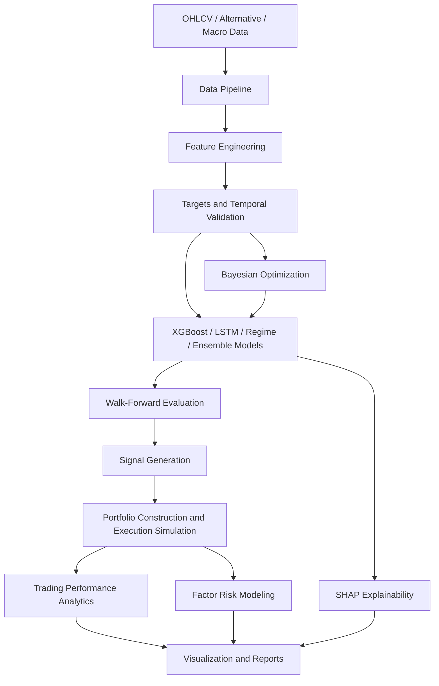

# AI-Driven Quant Research Platform Architecture

This scaffold is the starting point for an institutional-style quantitative research workflow.
Each module has a clear responsibility so research can move from raw market data to validated
trading signals without mixing data cleaning, modeling, backtesting, and reporting concerns.

## Module Roles

- `data/`: Ingests OHLCV data from CSV, yfinance, Alpha Vantage, and future data vendors.
  It owns timestamp alignment, missing-value handling, schema normalization, and raw/processed
  data boundaries.
- `features/`: Converts clean prices into predictive factors such as returns, momentum,
  volatility, volume, and market-structure features.
- `models/`: Contains forecasting models. Existing option-pricing models remain available,
  while `models/research.py` defines the predictive ML interface used by XGBoost, LSTM, ensemble,
  and regime-aware models.
- `evaluation/`: Measures both statistical quality and trading quality. In finance, a model
  with good RMSE can still be a poor trading strategy, so this module tracks IC, Sharpe, drawdown,
  and later CAGR, turnover, hit rate, and profit factor.
- `optimization/`: Houses Optuna and Bayesian search logic for model, feature, and strategy
  hyperparameters.
- `rl/`: Contains Gym-compatible trading environments and future DQN, PPO, and Actor-Critic
  training code.
- `explainability/`: Uses SHAP and model cards to explain which factors drive predictions and
  where a model may be unsafe.
- `visualization/`: Produces prediction, equity, drawdown, regime, SHAP, and portfolio charts.
- `notebooks/`: Stores guided research walkthroughs and interview-ready explanations.
- `tests/`: Verifies numerical behavior, schema contracts, and project architecture.
- `results/`: Stores generated charts, reports, model artifacts, and experiment outputs.

## Why This Architecture Matters

Quant research fails when experiments are not reproducible. Separating data, features, models,
evaluation, and reporting makes it easier to answer the questions that matter:

- Did the signal use only information available at the time?
- Does the model work out of sample?
- Does prediction quality translate into risk-adjusted returns?
- Which regime does the model fail in?
- Can another researcher reproduce the experiment?
