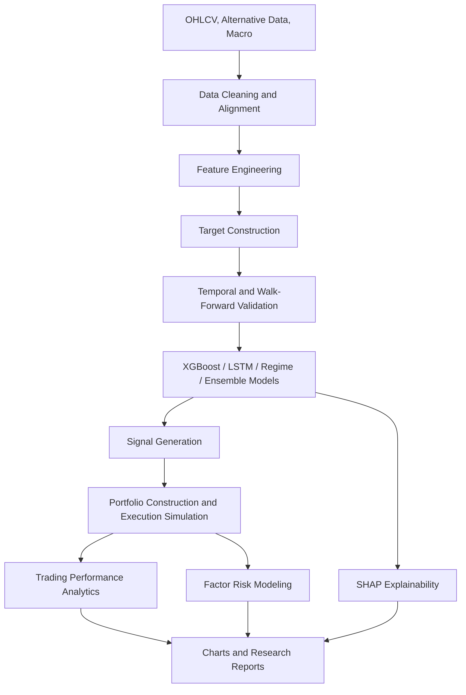

# AI-Driven Quant Research & Predictive Trading Platform

## Project Statement

This repository implements a complete AI-driven quantitative research and predictive trading
platform in Python. It combines market-data engineering, feature engineering, machine learning,
deep learning, explainability, reinforcement learning, regime detection, Bayesian optimization,
ensembles, walk-forward validation, factor risk modeling, trading simulation, and research
visualization.

The project is designed to resemble a simplified institutional quant research workflow:

```text
market data -> features -> targets -> models -> validation -> signals -> portfolio -> risk/reporting
```

## Core Platform Modules

`data/`
: OHLCV ingestion, CSV/yfinance adapters, cleaning, timestamp alignment, and feature-ready datasets.

`features/`
: Return, momentum, volatility, volume, and market-structure feature engineering.

`models/`
: XGBoost factor model, PyTorch LSTM forecaster, ensembles, sequence datasets, and shared model
interfaces.

`evaluation/`
: Targets, temporal splits, expanding/rolling validation, IC/IR, walk-forward research, model
reports, and ensemble comparisons.

`explainability/`
: SHAP values, feature importance, dependence data, local explanations, interaction summaries, and
model cards.

`rl/`
: Gymnasium trading environment, Buy/Sell/Hold actions, DQN/PPO/Actor-Critic factories, and policy
rollout evaluation.

`regime/`
: Deterministic, clustering-based, and HMM market regime detection plus regime-aware model
switching.

`alternative_data/`
: VADER sentiment, lazy FinBERT wrapper, Google Trends normalization, macro features, and
alternative-data feature alignment.

`optimization/`
: Optuna optimization for XGBoost, LSTM, and RL callbacks plus Hyperopt-compatible search spaces.

`risk/`
: Factor betas, factor covariance, portfolio exposure, return decomposition, volatility factor, and
risk contribution.

`trading/`
: Signal generation, risk-adjusted position sizing, long/short portfolio construction, execution
simulation, costs, slippage, and performance analytics.

`visualization/`
: Prediction, equity, drawdown, SHAP, feature dependence, regime, RL reward, and allocation charts.

`analytics/`
: Markdown model evaluation and factor analytics reports, plus the original options analytics
components retained from the prior project.

## Architecture



## Reproducible Demo

Run:

```powershell
.\.venv\Scripts\python.exe -m examples.run_ai_quant_demo
```

Outputs are written to:

```text
results/examples/ai_quant_demo/
```

Generated artifacts include:

- `synthetic_ohlcv.csv`
- `ai_quant_demo_summary.json`
- `walk_forward_summary.csv`
- `shap_importance.csv`
- `prediction_vs_actual.png`
- `equity_curve.png`
- `drawdown_curve.png`
- `performance_dashboard.png`
- `shap_importance.png`
- `regime_classification.png`
- `portfolio_allocation.html`
- `model_evaluation_report.md`
- `factor_analytics_report.md`

## Interview Pitch

I built an AI-driven quantitative research and predictive trading platform using Python. It
ingests and cleans market data, engineers financial features, defines leakage-safe targets, trains
XGBoost and LSTM models, explains predictions with SHAP, detects regimes using deterministic,
clustering, and HMM methods, supports reinforcement learning trading environments, tunes models
with Optuna, combines forecasts with ensembles, validates strategies through walk-forward testing,
models factor risk, converts predictions into portfolios, and evaluates trading performance with
Sharpe, CAGR, drawdown, information ratio, profit factor, turnover, and factor exposure analytics.

## Quality Evidence

The repository includes:

- automated tests across the platform
- Ruff linting
- public API checks
- package typing markers
- type hints and docstrings
- numerical validation helpers
- deterministic examples
- generated charts and reports
- architecture and code-quality documentation

Run:

```powershell
.\.venv\Scripts\python.exe -m pytest -q
.\.venv\Scripts\python.exe -m ruff check .
.\.venv\Scripts\python.exe -m examples.run_ai_quant_demo
```
